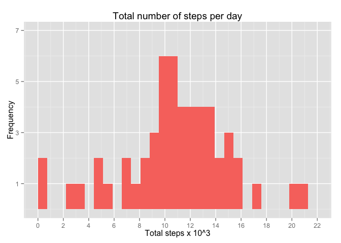
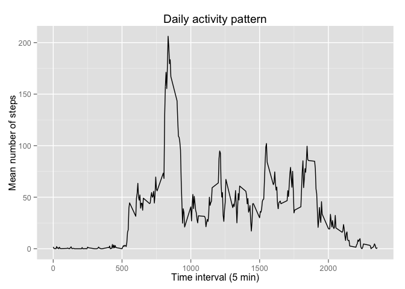
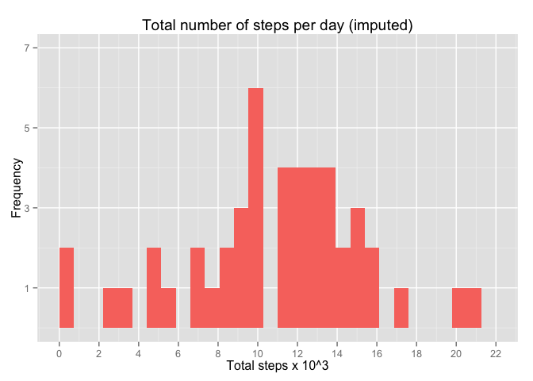
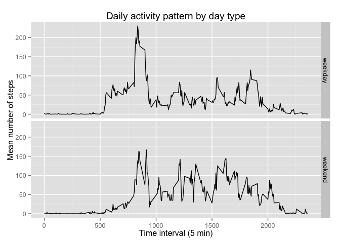

# Reproducible Research: Peer Assessment 1


## Loading and preprocessing the data

#### 1. Load the data.


```r
        if(!file.exists("data")){
                dir.create("data")
                }

        # Download the file
        Url <- "https://d396qusza40orc.cloudfront.net/repdata%2Fdata%2Factivity.zip"
        
        download.file(Url, destfile = "data/activity.zip", method = "curl")
        unzip("data/activity.zip", exdir = "data")
        
        # Read the file
        activity_data <- read.csv("data/activity.csv", header = TRUE)
```

#### 2. Process the file.


```r
        # Format the date
        library(lubridate)
        activity_data$date <- ymd(activity_data$date)
```


## What is mean total number of steps taken per day?

#### 1. Calculate the total number of steps taken per day.


```r
        s <- aggregate(list(steps = activity_data$steps), by = list(date = activity_data$date), sum)
        s$steps <- as.numeric(s$steps)
```

#### 2. Make a histogram of the total number of steps take per day.


```r
        library(ggplot2)

        #Divide sum by 1K to conver to kilo steps
        s$ksum <- s$steps/1000

        g <- ggplot(s, aes(s$ksum, fill = "red"))
        g + geom_histogram() +
                 labs(title = "Total number of steps per day", 
             y = "Frequency", x = "Total steps x 10^3") +
                scale_y_continuous(limits = c(0,7), breaks = seq(1,7,2)) +
                scale_x_continuous(limits = c(0,22), breaks = seq(0,22,2)) +
                theme(legend.position = "none")
```

```
## stat_bin: binwidth defaulted to range/30. Use 'binwidth = x' to adjust this.
```

 

#### 3. Calculate and report the mean and median of the total number of steps taken per day.


```r
        mean_steps <- mean(s$steps, na.rm = TRUE)
        median_steps <- median(s$steps, na.rm = TRUE) 
```

The mean number of steps is 1.0766189\times 10^{4} and median is 1.0765\times 10^{4}.


## What is the average daily activity pattern?

#### 1. Time series plot of the 5-minute interval and the average number of steps taken, averaged across all days.


```r
        #Find the average number of steps per each 5 minute interval
        avg_steps <- aggregate(list(steps = activity_data$steps),
                               by = list(interval = activity_data$interval),
                               mean, na.rm = TRUE)

        #Plot this as a time series
        ggplot(avg_steps, aes(interval, steps)) +
        geom_line() +
        labs(title = "Daily activity pattern", x = "Time interval (5 min)",
             y = "Mean number of steps")
```

 

#### 2. 5-minute interval, on average across all the days in the dataset, with the maximum number of steps.


```r
        # Convert the 5 min interval into a factor first.
        avg_steps$interval <- as.factor(avg_steps$interval)

        sorted <- avg_steps[order(-avg_steps$steps),]
        sorted[1,1]
```

```
## [1] 835
## 288 Levels: 0 5 10 15 20 25 30 35 40 45 50 55 100 105 110 115 120 ... 2355
```


## Imputing missing values

#### 1. Total number of missing values in the dataset.


```r
        sum(is.na(activity_data$steps))
```

```
## [1] 2304
```

#### 2. Devise a strategy for filling in all of the missing values in the dataset.

Replace missing values with the mean number of steps for that same interval across all days.

#### 3. New dataset with imputed data


```r
        imp_act <- activity_data
        
        #Find indices for missing values
        missing <- which(is.na(activity_data$steps))

        #Replace the missing values
        imp_act$steps[missing] = rep(avg_steps$steps, 288)[missing]
```

#### 4. Make a histogram of the total number of steps taken each day and Calculate and report the mean and median total number of steps taken per day. Do these values differ from the estimates from the first part of the assignment? What is the impact of imputing missing data on the estimates of the total daily number of steps?


```r
        s2 <- aggregate(list(steps = imp_act$steps), by = list(date = imp_act$date), sum)
        s2$steps <- as.numeric(s2$steps)

        #Divide sum by 1K to conver to kilo steps
        s2$ksum <- s2$steps/1000

        g <- ggplot(s2, aes(ksum, fill = "red"))
        g + geom_histogram() +
                 labs(title = "Total number of steps per day (imputed)", 
             y = "Frequency", x = "Total steps x 10^3") +
                scale_y_continuous(limits = c(0,7), breaks = seq(1,7,2)) +
                scale_x_continuous(limits = c(0,22), breaks = seq(0,22,2)) +
                theme(legend.position = "none")
```

```
## stat_bin: binwidth defaulted to range/30. Use 'binwidth = x' to adjust this.
```

 

```r
        mean_steps2 <- mean(s2$steps, na.rm = TRUE)
        median_steps2 <- median(s2$steps, na.rm = TRUE) 
```

The mean number of steps per day using this imputed data is 1.0766189\times 10^{4} and the median is 1.0766189\times 10^{4}. These are exactly the same as the values calculated ignoring the missing data (mean = 1.0766189\times 10^{4}, median = 1.0765\times 10^{4}).


## Are there differences in activity patterns between weekdays and weekends?

#### 1. Create a new factor variable in the dataset with two levels – “weekday” and “weekend” indicating whether a given date is a weekday or weekend day.


```r
        # Make a vector of weekdays
        weekdays <- c("Monday", "Tuesday", "Wednesday", "Thursday", "Friday")

        # Make a new variable column with day type (weither weekday or weekend) by
        # looking whether a particular date corresponds to a day within the 
        # weekday vector.
        
        days_act <- imp_act
        days_act$day <- ifelse(weekdays(imp_act$date) %in% weekdays, "weekday", "weekend")
```

#### 2. Panel plot containing a time series plot of the 5-minute interval and the average number of steps taken, averaged across all weekday days or weekend days.


```r
        #Find the average number of steps per each 5 minute interval
        avg_steps2 <- aggregate(list(steps = days_act$steps),
                               by = list(interval = days_act$interval,
                                         day = days_act$day),
                               mean, na.rm = TRUE)

        #Plot this as a time series
        ggplot(avg_steps2, aes(interval, steps, day)) +
        geom_line() + facet_grid(day ~ .) +
        labs(title = "Daily activity pattern by day type", x = "Time interval (5 min)",
             y = "Mean number of steps")
```

 

The early morning peak activity starts a bit later on weekends and doesn't peak as high as on weekdays. There is also more activity during the midday hours and this doesn't taper off until later at night on weekends compared to weekdays.  


